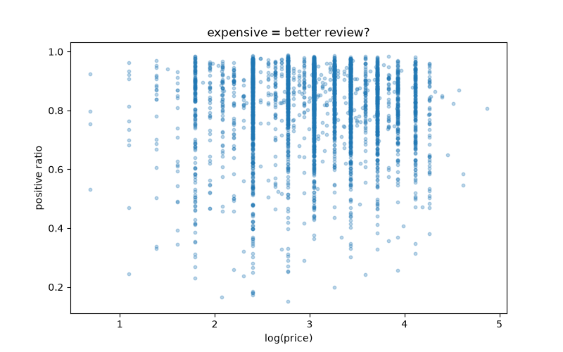
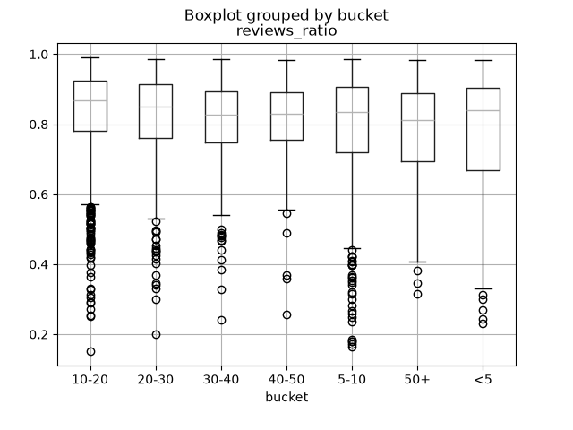
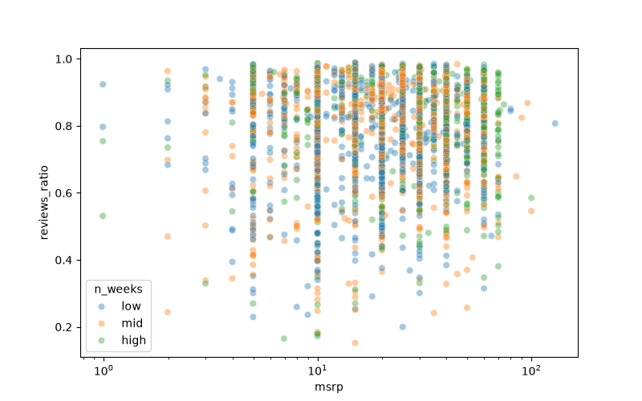

# Los juegos caros tienen mejores reviews?

Analisis de **125 millones de reviews de Steam** sobre **3816 juegos** que alguna vez entraron en el top semanal de ventas (2009-2026): analisis exploratorio + test de hipotesis

> **Resultado corto:** sí existe una diferencia real entre las reviews de juegos caros y
> baratos, pero es **pequeña** — y va en contra de la intuición: los caros tienden a tener
> reviews *levemente peores* (~5.8 puntos menos de mediana). Lo que sí predice mejores
> reviews es la **fama** (semanas sostenidas en el top), no el precio.

## Resultados

| Pregunta | Respuesta |
|---|---|
| Existe diferencia entre caros y baratos? | **Si**, Mann-Whitney U, p = 9.45e-10 |
| Cuanto importa? | **Poco** - Cliff's delta = 0.24 (efecto pequeno) |
| Cuanto en concreto? | Mediana 81.1% (>=50) vs 86.6% ($10-20); IC 95% [-0.77, -0.31] |
| Que predice mejor las reviews? | La fama: 82.3% -> 87.3% reviews positivas por tercil |

## Datos

| Datos | Valor |
|---|---|
| Juegos analizados | 3.816 (>= 50 reviews) |
| Reviews totales | 125.7 millones |
| Fuente | API publica de Steam (top sellers semanales, desde dic 2009) |
| Features | msrp, semanas en top, ratio de reviews positivas, edad, bucket de precio |

## Stack
Python - pandas - NumPy - SciPy - statsmodels - matplotlib - seaborn - Jupyter

## Estructura del repo

scripts/             # pipeline reproducible (fetch -> enrich -> reviews -> dataset)
  fetch_topsellers.py   # ~90 min: topsellers semanales desde 2009
  enrich_getitems.py    # ~5 min:  enriquece con precio/features via GetItems
  fetch_reviews.py      # 80 min: reviews de cada juego (sin API key)
  build_dataset.py      # 5 seg:  dataset final con feature engineering
notebooks/           # narrativa (corren sobre data/dataset.csv, sin re-fetchear)
  01_exploration.ipynb  # como se consiguieron los datos (endpoints descartados)
  02_eda.ipynb          # distribuciones, correlaciones, outliers
  03_analysis.ipynb     # test de hipotesis + tamanio de efecto + bootstrap
data/                # dataset final + datos intermedios
img/                 # figuras del analisis

## Reproduccion

1. `pip install -r requirements.txt`
2. Copiar `.env.example` a `.env` y setear `API_KEY`
3. `python scripts/fetch_topsellers.py`   # ~90 min
4. `python scripts/enrich_getitems.py`    # ~5 min
5. `python scripts/fetch_reviews.py`      # ~80 min
6. `python scripts/build_dataset.py`      # ~5 seg
7. Correr los notebooks en orden (01 -> 02 -> 03)

> Los notebooks funcionan sin re-fetchear (datos incluidos)
> Los scripts solo se necesitan para regenerar los datos desde cero

## Limitaciones

- Correlacion no es causalidad: el precio no *causa* reviews malas, solo se asocia
- El efecto es pequeno en la practica (~6 puntos de mediana)
- Algunos juegos caros del top son bundles/DLCs, no titulos individuales
- `age_days` depende del dia de ejecucion del script

## Licencia

MIT